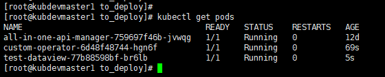
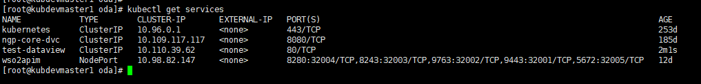
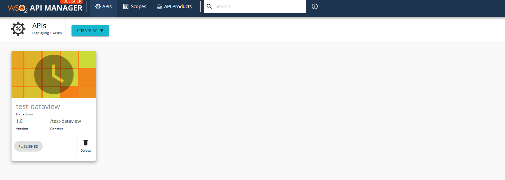
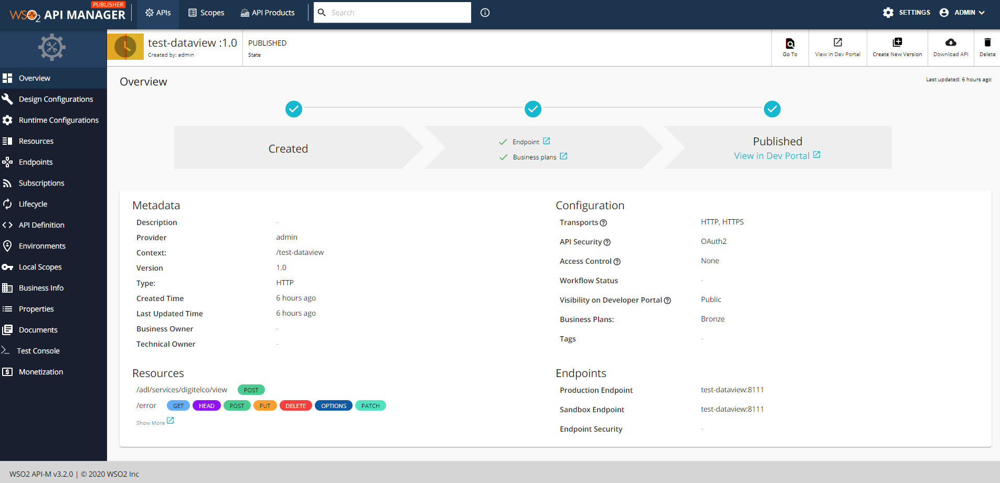

# Custom Kubernetes Operator for API Exposing

Here we are going to use Kubernetes Operator Pythonic Framework (Kopf) to build a simple operator to create and publish APIs in API Gateway(WSO2 API Manager) when an API is deployed in a kubernetes environment.Let's check out the pre-requisites
* Working Kubernetes cluster - https://kubernetes.io/docs/home/
* Helm - https://helm.sh/
* Python
* WSO2 API Manager 3.2.0 - https://apim.docs.wso2.com/en/3.2.0/

I'm assuming that there is a working kubernetes cluster and WSO2 API Manager is already deployed and available in the cluster.

## Step 1. Create an Operator
* ### Create a Custom Resource Definition (CRD)
Find the custom_resource_definition.yml file inside the /oda.

```yaml
apiVersion: apiextensions.k8s.io/v1beta1
kind: CustomResourceDefinition
metadata:
  name: components.oda.tmforum.org
spec:
  scope: Namespaced
  group: oda.tmforum.org
  versions:
    - name: v1alpha1
      served: true
      storage: true
  names:
    kind: component
    plural: components
    singular: component
    shortNames:
      - cp
```
```bash
kubectl apply -f custom_resource_definition.yml
```

This will create a new object component in the cluster, but it will need a controller to manage this object, which will be next step.

* ### Create an Operator handler to manage the CRD object
Find the operator_handler.py script inside the /operator and change the APIM application details accordingly there.

```properties
consumer_key = "RfI05Aa7KOxnOYVWK0fe6hgNXmca"
consumer_secret = "LOkDasjJtByow8SHobFLdCOKU9sa"
apim_token_url = "https://localhost:8243/token?grant_type=client_credentials&scope=apim:api_view " \
                 "apim:api_create apim:api_publish"
apim_api_create_url = "https://localhost:9443/api/am/publisher/v1/apis/import-openapi"
apim_api_publish_url = "https://localhost:9443/api/am/publisher/v1/apis/change-lifecycle?action=Publish&apiId="
name_space = "selfcare"
delay_time = 7
```

Find the deploy script inside the /operator and execute it.
```bash
docker build -t nipunthilakshan/operator:custom .
docker push nipunthilakshan/operator:custom
kubectl delete -f service_account.yml
kubectl create -f service_account.yml
kubectl delete -f service_account_binding.yml
kubectl create -f service_account_binding.yml
kubectl delete -f app_deployment.yaml
kubectl create -f app_deployment.yaml
```
```bash
./deploy
```
This will
- Create and publish a docker image to the docker registry which consists the operator controller.
- Create a service account and assign it to the operator pod with permission to create resources in the cluster.
- Create a deployment for the operator.

## Step 2. Dockerizing a sample Spring Boot Application
Find the deploy script inside the /java-sample-ms and execute it.
```bash
docker build -t nipunthilakshan/view-api .
docker push nipunthilakshan/view-api
```
```bash
./deploy
```

This will create and publish a docker image of sample Spring Boot application to the docker registry.The sample api/application is available at the directory of /viewer.

## Step 3. Deploy the sample application using HELM charts
Find the test-instance.component.yaml file inside the /oda and install the component using Helm.
```yaml
---
# Source: dataviewer/templates/service-dataviewerapi.yaml
apiVersion: v1
kind: Service
metadata:
  name: test-dataview
  labels:
    app: test-dataview
    oda.tmforum.org/componentName: test-dataviewer
spec:
  ports:
    - protocol: TCP
      port: 80
      targetPort: 8111
  type: ClusterIP
  selector:
    app: test-dataview
---
# Source: dataviewer/templates/deployment-dataviewerapi.yaml
apiVersion: apps/v1
kind: Deployment
metadata:
  name: test-dataview
  labels:
    oda.tmforum.org/componentName: test-dataviewer
spec:
  replicas: 1
  selector:
    matchLabels:
      app: test-dataview
  template:
    metadata:
      labels:
        app: test-dataview
    spec:
      containers:
        - name: test-dataview
          image: nipunthilakshan/view-api
          command: ["/bin/sh"]
          args: ["-l", "-c", "cd /root/ && java -jar /root/view-api.jar"]
          imagePullPolicy: Always
          ports:
            - name: test-dataview
              containerPort: 8111
          volumeMounts:
            - mountPath: /logs/
              name: log-volume
            - mountPath: /etc/configs/
              name: configs
      volumes:
        - name: log-volume
          hostPath:
            # directory location on host
            path: /var/log/logs/
        - name: configs
          hostPath:
            # directory location on host
            path: /etc/configs/
---
# Source: dataviewer/templates/component-dataviewer.yaml
apiVersion: oda.tmforum.org/v1alpha1
kind: component
metadata:
  name: test-dataviewer
  labels:
    oda.tmforum.org/componentName: test-dataviewer
spec:
  type: dataviewer
  selector:
    matchLabels:
      oda.tmforum.org/componentName: test-dataviewer
  componentKinds:
    - group: core
      kind: Service
    - group: apps
      kind: Deployment
  version: "0.0.1"
  description: "Simple Data Viewer ODA-Component from Open-API reference implementation."
  maintainers:
    - name: Nipun Thilakshan
      email: ngnthilakshan@gmail.com
  owners:
    - name: Nipun Thilakshan
      email: ngnthilakshan@gmail.com
  coreFunction:
    exposedAPIs:
      - name: test-dataview
        specification: Sample implementation
        implementation: test-dataview
        path: /v2/api-docs
        developerUI: /swagger-ui.html#/
        port: 8111
    dependantAPIs: []
  eventNotification:
    publishedEvents: []
    subscribedEvents: []
  management: []
  security:
    securitySchemes:
      bearerAuth:
        type: http
        scheme: bearer
        bearerFormat: JWT

```
```bash
helm template test dataviewer > test-instance.component.yaml
helm install test dataviewer/
```

This will deploy the Spring Boot application and it will trigger the operator.Then the operator will create and publish the Spring Boot application in WSO2 API Manager.

**Available pods list**




**Available services list**



**API Manager**





## References
1. https://github.com/tmforum-oda/oda-ca-docs/tree/master/ODA-Component-Tutorial
2. https://www.opcito.com/blogs/implementing-kubernetes-operators-with-python